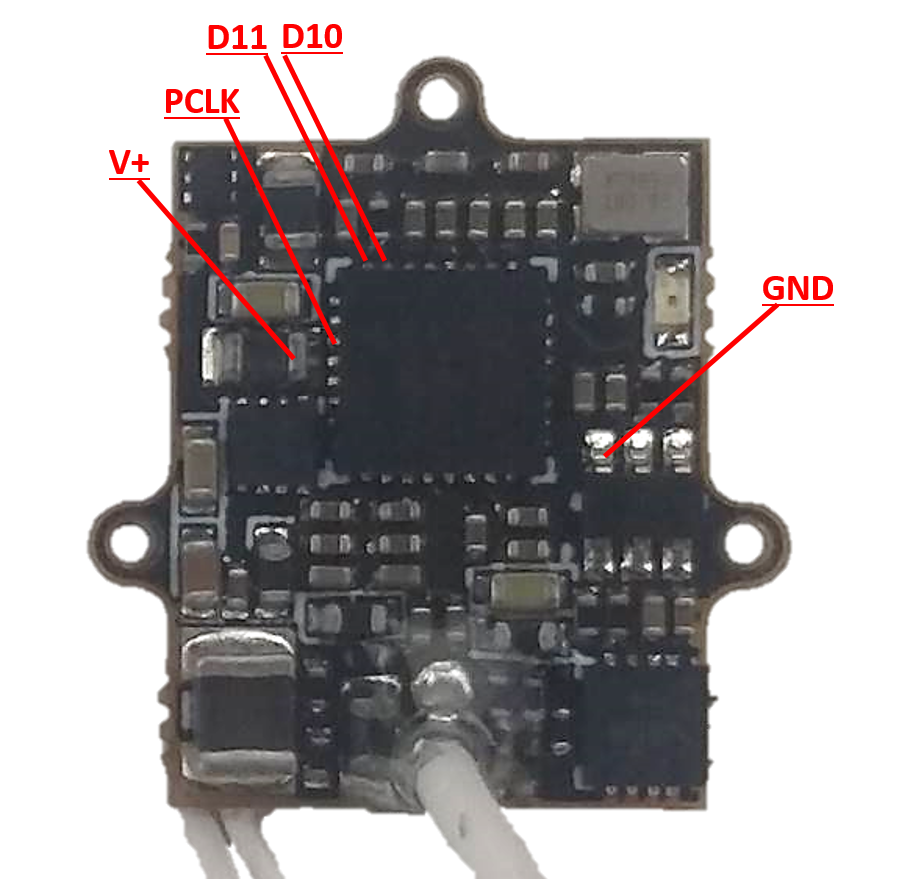
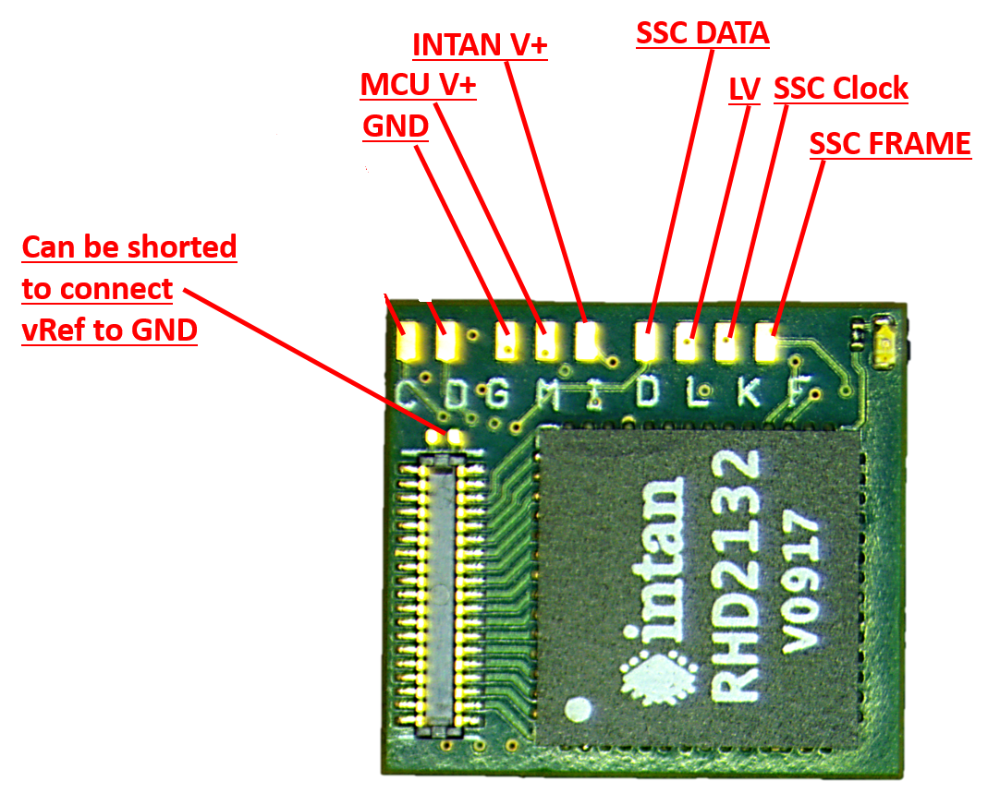
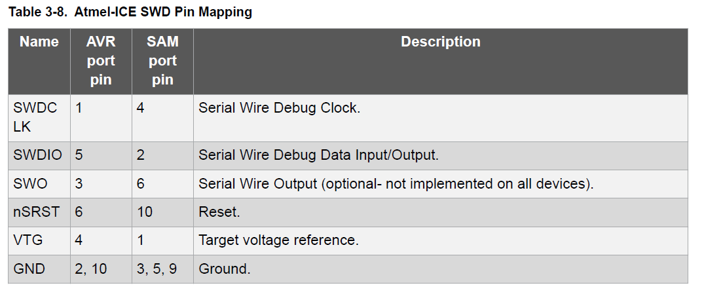
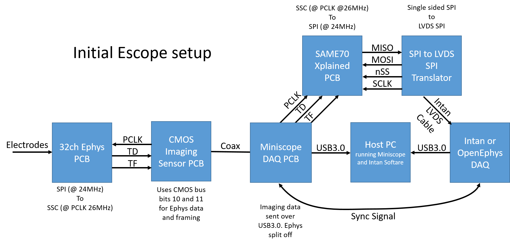
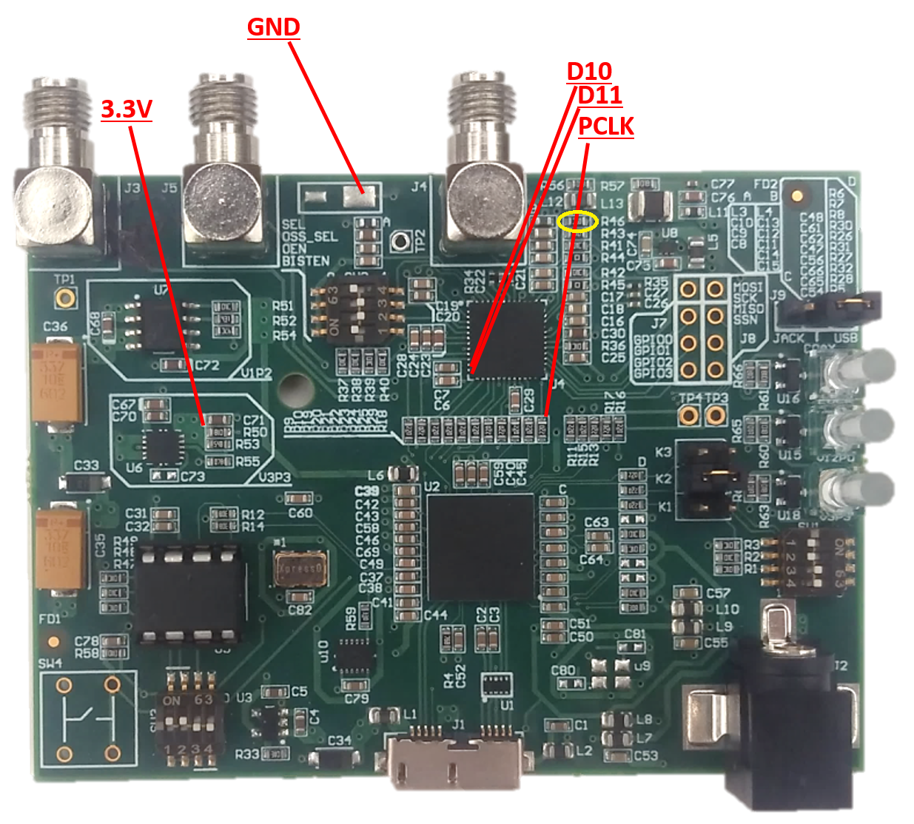
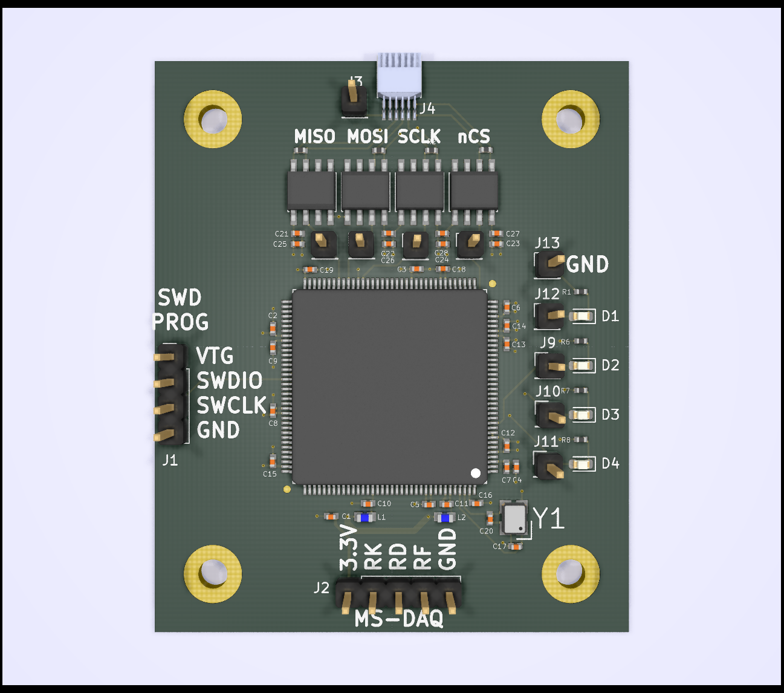

## Tutorial for assembling and using the integrated ephys Miniscope

Here we discuss the setup for the E-Scope. Below outlines the steps involved in assembling the head-mounted portion and DAQ portion of the system.

## Head-mounted E-Scope soldering and assembly

#### Components that need to be bought

* [Atmel ICE](https://www.digikey.com/products/en?mpart=ATATMEL-ICE&v=150) for programming the wire-free PCB
* Mill-Max 50mil male and female headers. You can get these from digikey.com and they are used to connect the INTAN PCB to the CMOS PCB. These are optional and generally should be skipped for mice.

#### Software to download
* Download [Atmel Studio](https://www.microchip.com/mplab/avr-support/atmel-studio-7). This will be used to program the microcontroller firmware onto the CMOS PCB.
* Downloaod the [Intan RHD2000 Interface Software](http://intantech.com/files/RHD2000interface_compiled_v1_5_2.zip). This will be used to connect and record ephys data.

### 1) Soldering wires to connect the CMOS PCB to the INTAN PCB

We first need to wire up 5 wires on the CMOS PCB. You should use very thing wiring for this (~0.25mm diameter conductors) since some of these connections will attach directly to the side pad of the serializer chip. You can use very thing "wire-wrap" wire which is single core or you can use mutlicore wire. Single core has the advantage of not splaying out but it is also less flexible. Once soldered, you should lay all 5 wires down across the top of the serializer and epoxy them (with a PCB safe glue/epoxy) so that no strain is applied to the solder connections. 

Below is a picture of the locations to solder the 5 wires. 
* D10 and D11 will carry the SSC Clock and SSC Data lines. 
* PCLK carries the pixel clock which will drive the SSC data protocol out of the INTAN PCB. 
* Finally, V+ and GND will provide power to the INTAN PCB.

### 2) Soldering wires onto the INTAN PCB

Now we need to solder the wires coming off the CMOS PCB onto the INTAN PCB. We have the choice to either directly solder these wires or to place a MillMax 50mil pitch header on these pads to connectorize them. For mice I would suggest directly soldering to minimize size and weight.

For connecting to the CMOS PCB v3.2 you will do the following connections (shown in the image below:
* GND connects to GND
* MCU V+ connects to V+
* INTAN V+ connects to V+
* SSC DATA connects to D10 or D11 (either is fine but keep this consistent across the E-Scopes you assemble
* LV can be left unconnected
* SSC Clock connects to PCLK
* SSC FRAME connects to D10 or D11 (use which ever one you didn't connect SSC DATA to)

### 3) Programming the MCU on the INTAN PCB

On one side of the INTAN PCB is the Intan RHD2132 chip and the other side is an ARM Cortex microcontroller (MCU). This MCU needs to be programmed once with the E-Scope firmware before it is functional. To do this we need to connect 4 lines to the INTAN PCB. This can, and maybe should, be done before completing step 2 above. The advantage of doing this programming step after completing step 2 above is the INTAN PCB can be powered through the coax cable and no additional power supply is needed.

You need to connect the following lines (refer to the images in step 2):
* SWCLK
* SWDIO
* MCU V+
* GND

These 4 lines need to be connected to an Atmel ICE which is the hardware necessary to program the MCU using an SWD protocol.
* In order to program the microcontroller on the INTAN  PCB, we first need to wire-up and connectorize a 4pin Mill-Max header to the 4 programming pins of the Atmel ICE programmer. These are GND, VTG (or V+), SWDIO, and SWDCLK. Below shows which pins/wires of the Atmel ICE have which function. The Atmel ICE has 2 different 5x2 pin ports. One is labeled AVR and one is labeled SAM. Either will work but depending on which one you are using it will change which column you refer to in the below chart.

* Connect the Atmel ICE to the programming header of the INTAN PCB.
* Power up the INTAN PCB throught either the coax cable (using the Miniscope DAQ) or directly connect 3.3V and GND from a power supply to the V+ and GND pads. 
* When the INTAN PCB gets powered on, you should see an orange light turn on on the Atmel ICE which shows that the Atmel ICE has detected voltage on the VTG (Voltage Target) pin.
* Open Atmel Studio and click the "Device Programming" button

* In the Device Programming window that pops up select:
  * Tool: Atmel ICE
  * Device: ATSAM....
  * Interface: SWD
  * Then click "Apply"
* Now check to make sure that Atmel Studio can communicate with the microcontroller on the INTAN PCB. You do this by clicking the "Read" button under Device Signature. If everything is powered and connected correctly you should see some numbers and letter pop up in the box and no error window show up. Now we are ready to program the microcontroller.
* Exit the Device Programming window.
* Now we have to do something a bit weird. I am not sure why this has to be done but it does. Open up the Atmel project found in the "/E-Scope-firmware" folder. This load up the code that makes up the INTAN MCU firmware. Now click "Debug" from the top menu bar and then click "Start Debugging and Break". Wait about 15 seconds while the debugger does its thing in Atmel Studio and then the code should jump to the "main()" function and highlight it. Now click the play button (labelled "Start Debugging") in the top menu. Wait a few seconds then click the stop button (labelled "Stop Debugging"). 
* Go back to the "Device Programming" window by clicking the "Device Programming" button.
* Click "Memory" on the left menu panel of the Device Programming window we are currently in.
* Click "Browse" and locate the E-Scope firmware. This is a .hex file you can find in the "/E-Scope-firmware" folder.
* Click "Program". This will erase, program, and verify the microcontroller. It will tell you if everything was successful.
* Now the microcontroller on the INTAN PCB knows how to be a wire-free Miniscope microcontroller.

## Miniscope DAQ E-Scope soldering and assembly

We now need to modify the standard Miniscope DAQ to be able to handle and transmit the ephys data from the E-Scope. We will do this by soldering 4 wires onto the DAQ PCB which will send the ephys data from the Miniscope DAQ to our SSC to INTAN LVDS PCB. We will roughly be following the following schematic:

As you can see from the schematic, these wires coming off of the Miniscope DAQ PCB will connect to hardware that basically undoes the SSC data protocol implemented by the MCU on the INTAN PCB and make an Intan DAQ think that it is talking directly to an Intan headstage.

### 1) Wire up the Miniscope DAQ PCB

Similar to what we did for wiring up the CMOS PCB, we need to wire up some lines for SSC DATA, SSC Clock, SSC FRAME, and power. See image below for which pads to solder to. Use the same wire as you used to wire up the CMOS PCB and epoxy these wires down to the DAQ PCB to remove any strain on the solder joints.

You definitely need to solder up D10, D11, PCLK, and GND. The need for the 3.3V connection will depend on which version of the system you are using. You might as well just solder this one up as well.

### 2) Change the Miniscope DAQ Deserializer Mode from 10 bits to 12 bits

We need to remove one resistor on the Miniscope PCB and short then now empty pads together . This resistor is responsible for change the Deserializer from using 10bit mode to 12bit mode. We need to do this because the CMOS imaging sensor uses the bottom 10 bits of the SERDES and the Ephys data uses the top 2 bits (TD, TF which are on pins D10 and D11). So **remove resistor R46 (which is circled in yellow above)** which is near the top of the PCB to the right of the SMA connector that goes to the head-mounted scope. Once you remove this resistor, we need to short the 2 open pads together which effectively changes this resistance to 0 ohms. You can build up a solder ball that spans these 2 pads, solder a short piece of metal across these 2 pads, or solder a 0ohm resistor in the R46 location. I recommend the last option.

### 3) Connect the Miniscope DAQ PCB to SSC-2-INTAN-LVDS PCB

Alright, we are almost done here. The ephys data coming out of the wires we soldered onto the Miniscope DAQ need to get converted to a data protocol an Intan DAQ understands. We do this using our custom SSC-2-INTAN-LVDS PCB. This PCB receives SSC (RF,RT,RK) and converts it to an LVDS SPI to be sent out over a 2x6 omnetics connector at the top of the PCB to an Intan or OpenEphys DAQ. Below is a rendering of this PCB.

At the bottom of this board is a 5 pin 100mil pitch header for connecting it to the Miniscope DAQ. I would suggest soldering a right angle header to this PCB pointing down. On the Miniscope DAQ, you can epoxy another 5 pin header to the edge of the PCB so that these 2 PCBs can be easily connected. The connections need to be the following:

**NOTE**

**For the original version of this PCB, the labelling is incorrect.** The order should 3.3V, RD, RF, RK, GND and not 3.3V, RK, RD, RF, GND.

| SSC-2-INTAN PCB | Miniscope DAQ PCB |
| --- | --- |
| GND | GND |
| 3.3V | 3.3V |
| RK | PCLK |
| RD | D10 or D11. Whichever one was connected to TD on the 32 channel Ephys PCB|
| RF | D10 or D11. Whichever one was connected to TF on the 32 channel Ephys PCB |

### 4) Program the MCU on the SSC-2-INTAN-LVDS PCB

Out last step is to program this PCB so it knows what it is suppose to do. Here we follow the same procedure we did above for programming the 32 Channel Ephys PCB. The programming header on the SSC-2-INTAN-LVDS PCB is on the left and includes the 4 connections you need access to through a 100mil pitch header. These are VTG (which will tell the Atmel ICE programmer to program the MCU at 3.3V), SWDIO, SWCLK, and GDN. Follow the steps above but program this MCU with the SSC-2-INTAN-LVDS firmware .hex file. This PCB needs to be powered up when programming which is done through the bottom 'MS-DAQ' 5 pin header by supplying 3.3V and GND. If you already have this hooked up to the Miniscope DAQ all you should need to do is power up the Miniscope DAQ and it should in turn power on this PCB.

## Hook everything up and test the system

We should now be done with all the hard work. All that is left to do is connect everything together and make sure we are getting correct data from the system. The overall layout should be:

32 Channel Ephys PCB -> CMOS sensor PCB -> coax -> Miniscope DAQ -> SSC-2-INTAN-LVDS PCB -> Intan or Open Ephys DAQ

All the power on all of these PCBs is floating which apperently introduces a ton of noise. **To fix this we need to connect building ground to the ground of the Miniscope system. This can be most easily done (be careful) by plugging in only the ground pin of an electrical cord into a wall electical socket and then clip the other end of the ground wire of the cable to the pin labeled 'GND' on the SSC-2-INTAN-LVDS PCB. Do this before powering everything up.**

Once you have connected building ground you can plug in the USB cable of the Miniscope DAQ and the USB cable and power jack of the Intan DAQ. Now open up the Intan DAQ software on the computer and make sure it detects the Intan DAQ and a 32 channel headstage. Right now the Intan DAQ thinks it is talking to an Intan headstage but it is actually talking to the SSC-2-INTAN-LVDS PCB. If you leave the coax cable unconnected from the Miniscope DAQ you will see placeholder data show up in the Intan DAQ software. This should look like DC voltages on all 32 channels with channel 0 having the lowest voltage and channel 31 having the highests. Once the head-mounted Miniscope coax cable is connected, this placeholder data gets replaced with real ephys data.

**A few important notes:**

* Generally you will want the ephys and imaging synced together. This is done by connecting one of the Intan DAQ digital input ports to the SYNC output of the Miniscope DAQ (which is the SMA connector labeled J5). Make sure to enable this digitial input pin in the Intan DAQ software. This will result in the Intan DAQ recording the SYNC signal from the Miniscope DAQ which will allow us to sync all the data offline. If you do this, **make sure to always start the Intan DAQ software recordinging before you start the Miniscope DAQ software recording.**

**Order of connecting and powering up the system**

* Hook up ground of the DAQ system to building ground
* Connect the Miniscope to Miniscope DAQ using the coax cable
* Hook up the DC power supply on the Intan DAQ
* Hook up the two USB cables. One for the Miniscope DAQ and one for the Intan DAQ
* Make sure that the sync cable is connected (Cable that connects the Intan board with the Miniscope DAQ)
* Open up Intan DAQ software and Miniscope DAQ software
* In the Intan software, click "Board Digital Inputs" radio button. Then turn on LOGIC DIN-00.
* Check everything is running correctly by clicking the "Runn" button in the Intan software and by connecting to the Miniscope using the Miniscope DAQ software.

**When ready to record**
* In the Intan software, click the "Select Vase Filename" button and name the ephys recording file.
* Click record in the Intan software
* Click record in the Miniscope DAQ software
* Do your recording
* Stop recording with the Miniscope DAQ software
* Stop recording with the Intan software

